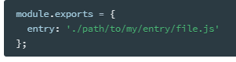
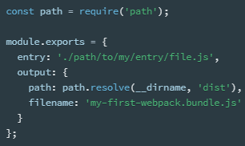
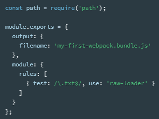
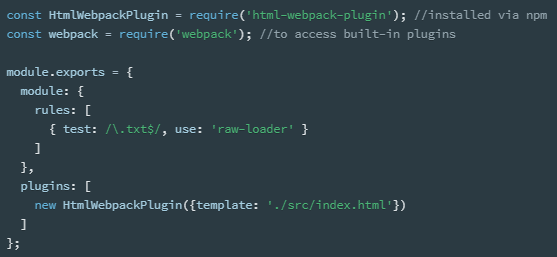
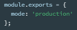

Concepts  ( https://webpack.js.org/concepts/ )
---------

<a name="4949">

# Core Concepts

</a>

Webpack 4.0

웹팩 : Webpack 은 공식 사이트 이미지에서 소개하듯이 웹페이지를 동작시키기 위한 서로 연관 관계가 있는 웹 자원(웹앱 애플리케이션의 구성파일)들인 js, css, img, webfont, etc.. 와 같은 구성파일들의 관계들을 Webpack 에서 인식하여 번들링하게 되면 최종적으로 기존의 원본 파일들을 압축, 축소하여 최적화된 스택틱 자원(파일)으로 변환해주는 작업(웹페이지 성능 최적화)을 하게 되는데 이러한 작업을 번들링이라고 하고 webpack은 모듈 번들러이다.

모듈 번들러 : 모듈 번들러란 웹 애플리케이션을 구성하는 웹 자원(HTML, CSS, Javscript, Images 등)을 모두 각각의 모듈로 보고 이 자원들의 의존성 관계들을 묶고 조합하여 병합된 하나의 결과물(스택틱한 자원으로 변환)을 자동으로 만들어 주는 도구를 의미합니다.

##### Concepts

</a>

*   

    
<a name="4949">웹팩의 핵심은 Modern Javascript Application을 위한 정적 모듈 번들러다. 웹팩이 application을 처리할때, 프로젝트가 필요로 하는 모든 모듈을 매핑하고 하나 이상의 bundles를 생성하는</a> [dependency graph](https://webpack.js.org/concepts/dependency-graph/)를 내부적으로 구축한다.

*   
4.0.0 버전부터 웹팩은 configuration file을 필요로 하지 않지만 더 나은 요구를 충족하기 위해서는 config설정이 필요하다.

To get started you only need to understand its Core Concepts: 

*   
Entry

*   
Output

*   
Loaders

*   
Plugins

*   
Mode

*   
Browser Compatibility

module bundlers에 대한 숨겨진 아이디어와 어떻게 동작하는 지에 대하여 이해하고자 하면 다음 리소스를 참고.

*   
Manually Bundling an Application

*   
Live Coding a Simple Module Bundler

*   
Detailed Explanation of a Simple Module Bundler

<a name="4942">

# [SUB]Core Concepts

Core Concepts

Entry

entry point는 internal dependency graph의 구축을 시작하기 위해 어떤 모듈 웹팩을 사용해야 하는지 나타낸다. 웹팩은 entry point가 어떤 다른 모듈과 라이브러리에 의존하는지를 파악한다.(직간접적으로)

기본 entry point 값은 ./src/index.js 이지만 아래와 같이 다른 경로 (or multiple entry points)를 지정할 수 있다.

Output

output 프로퍼티는 웹팩이 어디에 bundles을 생성할지, 어떤 name으로 생성할 지에 대한 것이다. 기본값은 주 출력 파일은 ./dist/main.js 이고 다른 파일들의 경우 ./dist 폴더로 설정되어 있다.

위의 예에서 output.path와 output.filename에서 출력을 설정한다. 코드의 위에 있는 path는 파일 경로를 조작하는 데 사용되는 core node.js 모듈이다.

[output 속성은 더 많은 설정을 할 수 있으며 자세한 것은 해당 section을 참조.]

Loaders

*   
ES5 <> ES6,  react의 JSX, SASS등의 변환을 수행.

웹팩은 오로지 JS와 JSON 파일만을 이해합니다. 로더는 웹팩이 다른 type의 파일을 처리하고 당신의 application에서 소비되는 valid한 모듈로 변환할 수 있도록 하여 dependency graph에 추가할 수 있도록 한다.

높은 수준에서 로더는 webpack config에서 두 가지 프로퍼티를 가지고 있습니다.

위의 설정에서 단일 모듈에 대한 두 가지(test,use) rules 속성을 가지고 있다. 이것은 웹팩 컴파일러에게 다음의 것들을 알려준다.

*.txt파일 중 require() 또는 import 문을 만나면 bundles에 추가하기 전에 raw-loader를 사용하여 변환하라. 라는 명령을 내리는 것이다.

Plugins

로더는 특정한 종류의 모듈을 변환하기 위하여 사용되는 반면, plugins은 bundle 최적화, asset management, 환경 변수 주입과 같은 광범위한 작업을 수행할 수 있다.

pluginsㅇ르 사용하기 위해서는 require()를 사용하여 plugin array에 추가해야한다. config에서 플러그인을 여러번 사용할 수 있고 new 연산자와 함께 호출하여 인스턴스를 생성해야 한다.

위의 예에서 html-webpack-plugin은 생성된 모든 bundles을 자동적으로 HTML파일에 주입하여 생성하는 것이다.

Mode

mode parameter를 development, production, none으로 설정하면 각 환경에 해당하는 최적화를 수행할 수 있다. 기본값은 production

[대충 파악하기로는...  development는 bundles.js소스보기 시 이쁘게 나오고 production은 난독화,minify해서 나옴]

Browser Compatibility

웹팩은 ES5를 준수하는 모든 브라우저(IE8 and below 제외)에 대한 지원을 한다. 웹팩은 import() 와 require.ensure()를 위하여 promise가 필요하기 때문이다. 만약 이전 버전에 대한 브라우저 지원이 필요하면 load a polyfill을 사용해라.(홈페이지 참조)

</a>

